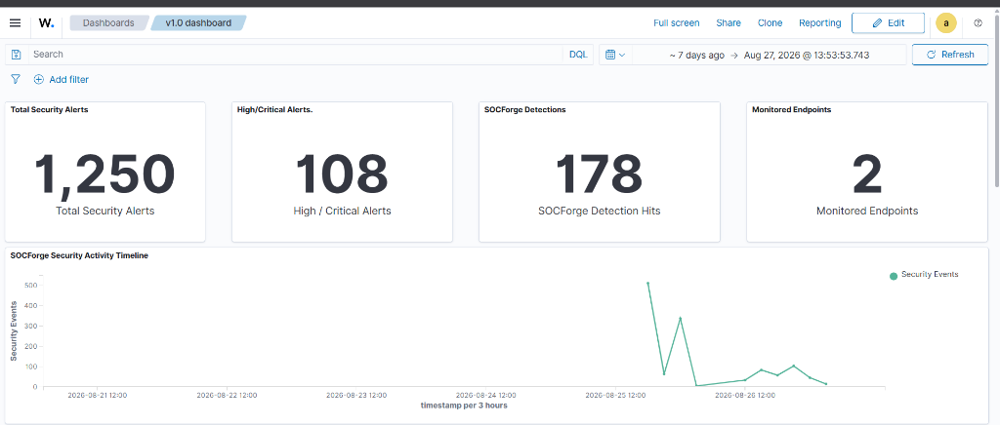
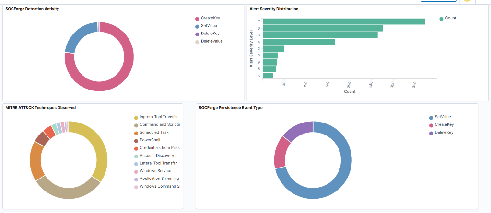
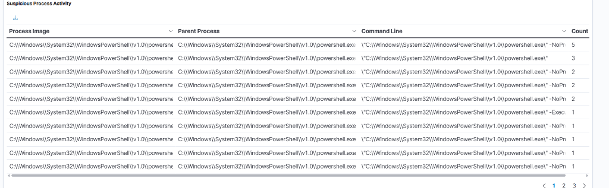
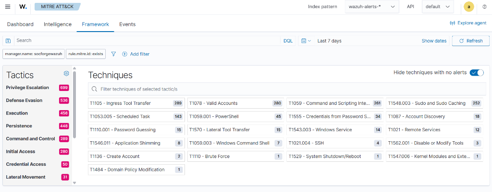

# 🛡️ SOCForge: Enterprise Detection Engineering & Incident Response Lab

[](https://attack.mitre.org/)
[](https://wazuh.com/)
[](https://learn.microsoft.com/en-us/sysinternals/downloads/sysmon)
[](https://www.microsoft.com/windows)
[](https://www.kali.org/)
[](LICENSE)

---

## 📌 Executive Overview

**SOCForge** is an enterprise-grade cybersecurity detection engineering, attack simulation, and incident investigation laboratory built inside an isolated virtual environment. 

It demonstrates the complete lifecycle of modern security operations: from external adversary reconnaissance and HTTP C2 ingress staging, through privilege escalation and persistence, to real-time SIEM detection rule authoring, hypothesis-driven threat hunting, and verified forensic eradication.


---

## 📊 Detection Engineering & Lab Metrics

| Metric | Result | Context |
|:---|:---:|:---|
| **Total Custom Detections Engineered** | **6** | Custom XML rules (`100100`–`100105`) |
| **Detections Validated Live** | **6 / 6 (100%)** | Unit-tested with `wazuh-logtest` & live telemetry |
| **MITRE ATT&CK Coverage** | **6 Tactics / 10 Techniques** | Recon, Execution, Persistence, PrivEsc, C2, Discovery |
| **Forensic Timeline Events** | **21 Events** | Reconstructed across 6 strictly chronological phases |
| **Correlated ProcessGUIDs** | **11 GUIDs** | Traced to root parent session (PID 572) |
| **Investigation Case Studies** | **CASE-001** | Full incident lifecycle report & timeline |
| **IR Playbooks Authored** | **2** | Scheduled task eradication & backdoor user removal |

---

## 🖥️ Live SOC Operations Dashboard

The custom **SOCForge Security Operations Dashboard** provides single-pane-of-glass visibility across the entire attack lifecycle, custom detection metrics, and endpoint forensics:

### 1. Executive KPIs & Incident Timeline

*Figure 1: Top-level executive KPIs showing 1,250 total alerts, 108 high/critical incidents, 178 custom SOCForge detection hits across 2 monitored endpoints, and the attack activity timeline.*

### 2. Detection Analytics & MITRE ATT&CK Breakdown

*Figure 2: Custom detection activity breakdown, alert severity level distribution (Levels 3–15), MITRE ATT&CK technique distribution, and persistence event types (Sysmon EID 12).*

### 3. Forensic Process Investigation Table

*Figure 3: Forensic process investigation table tracking parent/child relationships (PowerShell PID 572), obfuscated arguments, and execution counts.*

## 🏗️ Architecture & Network Topology


*See [`architecture/architecture.md`](architecture/architecture.md) for full topology details.*


---

## 🗺️ MITRE ATT&CK Matrix & Live SIEM Heatmap

| MITRE Tactic | Technique ID | Technique Name | Simulation Command / Telemetry | Detection Rule | Level |
|:---|:---|:---|:---|:---|:---:|
| **Discovery** | `T1046` | Network Service Discovery | `nmap -Pn -sS -p 135-5985 192.168.56.105` | Sysmon EID 3 (Inbound) | Low |
| **Command and Control** | `T1071.001` | Web Protocols (HTTP) | Outbound connection to `192.168.56.101:8080` | Rule `100103` | **Level 9** |
| **Command and Control** | `T1105` | Ingress Tool Transfer | Dropped file `C:\Windows\Temp\payload.ps1` (52 B) | Native Rule `92201` | **Level 9** |
| **Execution** | `T1059.001` | PowerShell Execution | `powershell.exe -ExecutionPolicy Bypass -File payload.ps1` | Rule `100100` / Native `92029` | **Level 7** |
| **Defense Evasion** | `T1027` | Obfuscated Files/Info | `powershell.exe -EncodedCommand VwBy...` | Rule `100101` / Native `92057` | **Level 10** / **12** |
| **Execution** | `T1059.003` | Windows Command Shell | `cmd.exe /c "whoami && netstat -ano"` | Rule `100102` / Native `92004` | **Level 8** |
| **Discovery** | `T1087` | Account Discovery | `whoami.exe`, `net.exe user` | Native Rules `92032`, `92039` | Level 3 |
| **Persistence** | `T1053.005` | Scheduled Task Creation | `schtasks.exe /create /tn "SOCForgePersistence"...` | Rule `100104` / Native `92154` | **Level 10** |
| **Privilege Escalation** | `T1136.001` / `T1098` | Local Account & Manipulation | `net user socforge_backdoor P@ssw0rd123! /add` | Rule `100105` | **Level 10** |

### 📊 Live Wazuh MITRE ATT&CK Dashboard View



---

## 📜 Custom Detection Engineering Catalog

All 6 custom rules are located in [`detections/wazuh/local_rules.xml`](detections/wazuh/local_rules.xml):

| Rule ID | Detection Focus | MITRE Technique | Rule Deep Dive |
|:---:|:---|:---:|:---|
| **`100100`** | PowerShell Process Execution | `T1059.001` | [`detections/windows/powershell-execution.md`](detections/windows/powershell-execution.md) |
| **`100101`** | Obfuscated / Encoded PowerShell | `T1059.001` / `T1027` | [`detections/windows/powershell-execution.md`](detections/windows/powershell-execution.md) |
| **`100102`** | Command Shell Spawned by PowerShell | `T1059.003` | [`detections/windows/powershell-execution.md`](detections/windows/powershell-execution.md) |
| **`100103`** | Outbound C2 Network Traffic | `T1071.001` | [`detections/windows/c2-network-traffic.md`](detections/windows/c2-network-traffic.md) |
| **`100104`** | Scheduled Task Persistence | `T1053.005` | [`detections/windows/scheduled-task-persistence.md`](detections/windows/scheduled-task-persistence.md) |
| **`100105`** | Backdoor User & Privilege Escalation | `T1136.001` / `T1098` | [`detections/windows/account-manipulation.md`](detections/windows/account-manipulation.md) |

---
---text
## 📁 Repository Structure


SOCForge/
├── README.md                           # Master repository documentation
├── LICENSE                             # MIT License
├── .gitignore                          # Standard git ignore rules
│
├── architecture/
│   └── architecture.md                 # Full network topology & telemetry pipeline
│
├── lab/
│   ├── wazuh-server.md                 # Wazuh Manager, OpenSearch & Analysisd setup
│   ├── windows-endpoint.md             # Windows 11, Sysmon & Agent EventChannel config
│   ├── kali-attacker.md                # Kali Linux adversary node & HTTP stager setup
│   └── network-configuration.md        # Subnet routing & IP allocations
│
├── detections/
│   ├── wazuh/
│   │   └── local_rules.xml             # Production XML detection rules (100100–100105)
│   └── windows/
│       ├── powershell-execution.md     # Rules 100100, 100101, 100102 deep dive
│       ├── scheduled-task-persistence.md # Rule 100104 deep dive
│       ├── account-manipulation.md     # Rule 100105 deep dive
│       └── c2-network-traffic.md       # Rule 100103 deep dive
│
├── attack-scenarios/
│   └── 001-kali-windows-intrusion/
│       ├── scenario.md                 # Step-by-step adversary simulation playbook
│       └── payload.ps1                 # Benign test stager script
│
├── investigations/
│   └── CASE-001/
│       ├── investigation.md            # Master incident investigation case report
│       └── timeline.md                 # Strictly chronological 21-event timeline
│
├── threat-hunting/
│   ├── hypothesis-001-lolbins.md       # Hypothesis-driven hunt for LOLBins & bypasses
│   └── hunting-queries.md              # Master grep hunting queries & ProcessGUID table
│
├── incident-response/
│   ├── scheduled-task-eradication.md   # Task persistence removal playbook
│   └── backdoor-account-removal.md     # Rogue administrator account removal playbook
│
├── validation/
│   └── detection-test-results.md       # Logtest and live validation matrix
│
└── screenshots/
    └── dashboards/                     # Live Wazuh SIEM portal evidence
```

---

## 👤 Author & License

- **Project:** SOCForge Cybersecurity Portfolio Project
- **Focus:** SOC Operations, SIEM Architecture, Detection Engineering, Threat Hunting & DFIR
- **License:** [MIT License](LICENSE)
