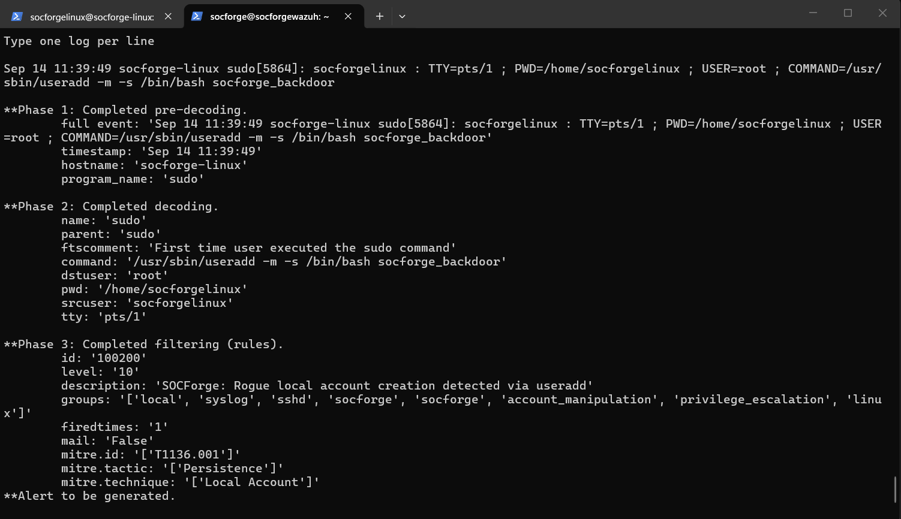

# Detection Rules: Linux Rogue Account Creation & Sudo Group Escalation

- **Rule IDs:** `100200` (Rogue Useradd), `100201` (Sudoers Group Escalation)
- **Severity Levels:** Level 10 (High) / Level 10 (High)
- **MITRE ATT&CK:** `T1136.001` (Create Account: Local Account), `T1098` (Account Manipulation), `T1548.003` (Sudo and Sudo Caching)
- **Data Source:** Linux Auditd / Syslog (PAM & Sudo command execution)
- **Platform:** Linux (Ubuntu 24.04 LTS / Debian)

---

## 1. Detection Objective
Detects when an attacker leverages `sudo` to spawn a new local user account (`useradd`) with persistent shells or elevates local users to administrative groups (`sudo`, `wheel`).

---

## 2. Wazuh Rule Logic

```xml
<!-- SOCForge Linux #1: Rogue Account Creation via useradd (T1136.001) -->
<rule id="100200" level="10">
  <if_sid>5402, 5403</if_sid>
  <field name="command" type="pcre2">(?i)useradd.*(socforge_backdoor|-m|-s)</field>
  <description>SOCForge: Rogue local account creation detected via useradd</description>
  <mitre><id>T1136.001</id></mitre>
  <group>socforge,account_manipulation,privilege_escalation,linux,</group>
</rule>

<!-- SOCForge Linux #2: Privilege Escalation via Sudo Group Manipulation (T1098) -->
<rule id="100201" level="10">
  <if_sid>5402, 5403</if_sid>
  <field name="command" type="pcre2">(?i)(usermod.*sudo|gpasswd.*sudo)</field>
  <description>SOCForge: Account added to privileged sudo group detected</description>
  <mitre><id>T1098</id><id>T1548.003</id></mitre>
  <group>socforge,privilege_escalation,account_manipulation,linux,</group>
</rule>
```

---

## 3. Sigma Equivalents
- [`proc_creation_lnx_useradd_backdoor.yml`](../sigma/proc_creation_lnx_useradd_backdoor.yml)
- [`proc_creation_lnx_usermod_sudoers.yml`](../sigma/proc_creation_lnx_usermod_sudoers.yml)

---

## 4. Live Logtest Validation Proof


*Figure 1: Wazuh-logtest validating Rule 100200 firing at Level 10 (High) for rogue useradd execution matching MITRE T1136.001.*

